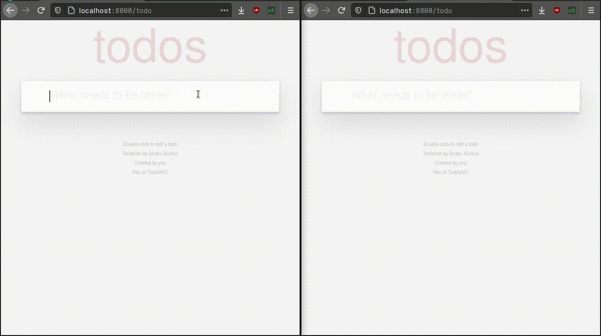

# Reactor, a LiveView library for Django

Reactor enables you to do something similar to Phoenix framework LiveView using Django Channels.



## What's in the box?

This is no replacement for VueJS or ReactJS, or any JavaScript but it will allow you use all the potential of Django to create interactive front-ends. This method has its drawbacks because if connection is lost to the server the components in the front-end go busted until connection is re-established. But also has some advantages, as everything is server side rendered the interface comes already with meaningful information in the first request response, you can use all the power of Django template without limitations, if connection is lost or a component crashes, the front-end will have enough information to rebuild their state in the last good known state.

## Installation and setup

Reactor requires Python >=3.9.

Install reactor:

```bash
pip install django-reactor
```

Reactor makes use of `django-channels`, by default this one uses an InMemory channel layer which is not capable of a real broadcasting, so you might wanna use the Redis one, take a look here: [Channel Layers](https://channels.readthedocs.io/en/latest/topics/channel_layers.html)

Add `reactor` and `channels` to your `INSTALLED_APPS` before the Django applications so channels can override the `runserver` command.

```python
INSTALLED_APPS = [
    'reactor',
    'channels',
    ...
]

...

ASGI_APPLICATION = 'project_name.asgi.application'
```

and modify your `project_name/asgi.py` file like:

```python
import os
os.environ.setdefault('DJANGO_SETTINGS_MODULE', 'project_name.settings')

import django
django.setup()

from channels.auth import AuthMiddlewareStack
from channels.routing import ProtocolTypeRouter, URLRouter
from django.core.asgi import get_asgi_application
from reactor.urls import websocket_urlpatterns

application = ProtocolTypeRouter({
    'http': get_asgi_application(),
    'websocket': AuthMiddlewareStack(URLRouter(websocket_urlpatterns))
})
```

Note: Reactor since version 2, autoloads any `live.py` file in your applications with the hope to find there Reactor Components so they get registered and can be instantiated.

In the templates where you want to use reactive components you have to load the reactor static files. So do something like this so the right JavaScript gets loaded:

```html

<!DOCTYPE html>
<html>
  <head>
    ... 
  </head>
  ...
</html>
```

Don't worry if you put this as early as possible, the scripts are loaded using `<script defer>` so they will be downloaded in parallel with the html, and when all is loaded they are executed.

## Simple example of a counter

In your app create a template `x-counter.html`:

```html

<div >
  {{ amount }}
  <button >+</button>
  <button >-</button>
  <button >reset</button>
</div>
```

Anatomy of a template: each component should be a [custom web component](https://developer.mozilla.org/en-US/docs/Web/Web_Components/Using_custom_elements) that inherits from [HTMLElement](https://developer.mozilla.org/en-US/docs/Web/API/HTMLElement). They should have an `id` so the backend knows which instance is this one and a `state` attribute with the necessary information to recreate the full state of the component on first render and in case of re-connection to the back-end.

Render things as usually, so you can use full Django template language, `trans`, `if`, `for` and so on. Just keep in mind that the instance of the component is referred as `this`.

Forwarding events to the back-end: Notice that for event binding in-line JavaScript is used on the event handler of the HTML elements. How does this work? When the increment button receives a click event `send(this, 'inc')` is called, `send` is a reactor function that will look for the parent custom component and will dispatch to it the `inc` message, or the `set_to` message and its parameters `{amount: 0}`. The custom element then will send this message to the back-end, where the state of the component will change and then will be re-rendered back to the front-end. In the front-end `morphdom` (just like in Phoenix LiveView) is used to apply the new HTML.

Now let's write the behavior part of the component in `live.py`:

```python
from reactor.component import Component


class XCounter(Component):
    _template_name = 'x-counter.html'

    amount: int = 0

    async def recv_inc(self):
        self.amount += 1

    async def recv_dec(self):
        self.amount -= 1

    async def recv_set_to(self, amount: int):
        self.amount = amount
```

Let's now render this counter, expose a normal view that renders HTML, like:

```python
def index(request):
    return render(request, 'index.html')
```

And the index template being:

```html

<!DOCTYPE html>
<html>
  <head>
    .... 
  </head>
  <body>
    

    <!-- or passing an initial state -->
    
  </body>
</html>
```

Don't forget to update your `urls.py` to call the index view.

### Persisting the state of the Counter in the URL as a GET parameter

Add:

```python
...

class XCounter(Component):
  _url_params = {"amount": "counter_amount"}  # local attr -> get parameter name

...
```

This will make it so when everytime amount is updated the URL will get [replaced](https://developer.mozilla.org/en-US/docs/Web/API/History/replaceState) updating the GET parameter `?&counter_amount=20` (in case counter=20). So the user can copy that URL and share it, or navigate back to it and you can retrieve that GET parameter and restore the state of the component.

```html
...
<body>
  
</body>
...
```

## Settings:

Default settings of reactor are:

```python

from reactor.schemas import AutoBroadcast

REACTOR = {
    "TRANSPILER_CACHE_SIZE": 1024,
    "USE_HTML_DIFF": True,
    "USE_HMIN": False,
    "BOOST_PAGES": False,
    "TRANSPILER_CACHE_NAME": "reactor:transpiler",
    "AUTO_BROADCAST": AutoBroadcast(
        # model-a
        model: bool = False
        # model-a.1234
        model_pk: bool = False
        # model-b.9876.model-a-set
        related: bool = False
        # model-b.9876.model-a-set
        # model-a.1234.model-b-set
        m2m: bool = False
        # this is a set of tuples of ('app_label', 'ModelName')
        # to subscribe for the auto broadcast
        senders: set[tuple[str, str]] = Field(default_factory=set)
    ),
}
```

- `TRANSPILER_CACHE_SIZE`: this is the size of an LRU dict used to cache javascript event halder transpilations.
- `USE_HTML_DIFF`: when enabled uses `difflib` to create diffs to patch the front-end, reducing bandwidth. If disabled it sends the full HTML content every time.
- `REACTOR_USE_HMIN`: when enabled and django-hmin is installed will use it to minified the HTML of the components and save bandwidth.
- `AUTO_BROADCAST`: Controls which signals are sent to `Component.mutation` when a model is mutated.

## Back-end APIs

### Template tags and filters of `reactor` library

- ``: that includes the necessary JavaScript to make this library work. ~10Kb of minified JS, compressed with gz or brotli.
- ``: Renders a component by its name and passing whatever parameters you put there to the `XComponent.new` method that constructs the component instance.
- ``: Binds an event handler with paramters to some event. Look at [Event binding in the front-end](#event-binding-in-the-front-end)
- `cond`: Allows simple conditional presence of a string: ``.
- `class`: Use it to handle conditional classes: `<div ></div>`.

## Component live cycle

### Initialization & Rendering

This happens when in a "normal" template you include a component.

```html

```

This passes those parameter there to `Component.new` that should return the component instance and then the component get's rendered in the template and is sent to the client.

### Joins

When the component arrives to the front-end it "joins" the backend. Sends it's serialized state to the backend which rebuilds the component and calls `Component.joined`.

After that the component is rendered and the render is sent to the front-end. Why? Because could be that the client was online while some change in the backend happened and the component needs to be updated.

### User events

When a component or its parent has joined it can send user events to the client. Using the `on` template tag, this events are sent to the backend and then the componet is rendered again.

### Subscriptions

Every time a component joins or responds to an event the `Componet._subscriptions` set is reviewed to check if the component subscribes or not to some channel.

- In case a mutation in a model occurs `Component.mutation(channel: str, action: reactor.auto_broadcast.Action, instance: Model)` will be called.
- In case you broadcast a message using `reactor.component.broadcast(channel, **kwargs)` this message will be sent to any component subscribed to `channel` using the method `Component.notification(channel, **kwargs)`.

### Disconnection

If the component is destroyed using the `Component.destroy` or just desapears from the front-end it is removed from the backend. If the the websocket closes all components in that connection are removed from the backend and the state of those componets stay just in the front-end in the seralized form awaiting for the front-end to join again.

#### Component API

Each component is a Pydantic model so it can serialize itself. I would advice not to mess with the `__init__` method.
Instead use the class method `new` to create the instance.

##### Rendering

- `_extends`: (default: `"div"`) Tag name HTML element the component extends. (Each component is a HTML5 component so it should extend some HTML tag)
- `_template_name`: Contains the path of the template of the component.
- `_exclude_fields`: (default: `{"user", "reactor"}`) Which fields to exclude from state serialization during rendering
- `_url_params`: (default: `{}`) Indicates which local attribute should be persisted in the URL as a GET parameter, being the key a local attribute name and the value the name of the GET parameter that will contain the value of the local attribute.

#### Subscriptions

- `_subscriptions`: (default: `set()`) Defines which channels is this component subscribed to.
- `mutation(channel, action, instance)` Called when autobroadcast is enabled and a model you are subscribed to changes.
- `notification(channel, **kwargs)` Called when `reactor.component.broadcast(channel, **kwargs)` is used to send an arbitrary notification to components.

#### Actions

- `destroy()`: Removes the component from the interface.
- `focus_on(selector: str)`: Makes the front-end look for that `selector` and run `.focus()` on it.
- `skip_render()`: Prevents the component from being rendered once.
- `send_render()`: Send a signal to request render the component ahead of time.
- `dom(_action: DomAction, id: str, component_or_template, **kwargs)`: Can append, prepend, insert befor or after certain HTMLElement ID in the dom, the component or template, rendered using the `kwargs`.
- `freeze()`: Prevents the component from being rendered again.
- `reactor.redirect_to(to, **kwargs)`: Changes the URL of the front-end and triggers a page load for that new URL
- `reactor.replace_to(to, **kwargs)`: Changes the current URL for another one.
- `reactor.push_to(to, **kwargs)`: Changs the URL of the front-end adding a new history entry but does not fetch the new URL from the backend.
- `reactor.send(_channel: str, _topic: str, **kwargs)`: Sends a message over a channel.

## Front-end APIs

- `reactor.send(element, name, args)`: Sends a reactor user event to `element`, where `name` is the event handler and `args` is a JS object containing the implicit arguments of the call.

### Event binding in the front-end

Look at this:

```html
  <button >Submit</button>
```

Syntax: 
The format for event and modifiers is `@<event>[.modifier1][.modifier2][.modifier2-argument1][.modifier2-argument2]`

Examples:

- `>`: Clicking with Ctrl pressed calls "decrement".
- `>`: Clicking calls "increment" passing `amount=1` as argument.

Misc:

- `event`: is the name of the HTMLElement event: `click`, `blur`, `change`, `keypress`, `keyup`, `keydown`...
- `modifier`: can be concatenated after the event name and represent actions or conditions to be met before the event execution. This is very similar as [how VueJS does event binding](https://vuejs.org/v2/guide/events.html#Event-Modifiers):

  Available modifiers are:

  - `inlinejs`: takes the next "event handler" argument as literal JS code.
  - `prevent`: calls `event.preventDefault()`
  - `stop`: calls `event.StopPropagation()`
  - `ctrl`, `alt`, `shift`, `meta`: continues processing the event if any of those keys is pressed
  - `debounce`: debounces the event, it needs a name for the debounce group and a delay in milliseconds. Example: `keypress.debounce.100.search`.
  - `key.<keycode>`: continues processing the event if the key with `keycode` is pressed
  - `enter`: alias for `key.enter`
  - `tab`: alias for `key.tab`
  - `delete`: alias for `key.delete`
  - `backspace`: alias for `key.backspace`
  - `space`: alias for `key. `
  - `up`: alias for `key.arrowup`
  - `down`: alias for `key.arrowdown`
  - `left`: alias for `key.arrowleft`
  - `right`: alias for `key.arrowright`

#### Event arguments

Reactor sends the implicit arguments you pass on the `on` template tag, but also sends implicit arguments.
The implicit arguments are taken from the `form` the element handling the event is in or from the whole component otherwise.

Examples:

Here any event inside that component will have the implicit argument `x` being send to the backend.

```html
<div >
  <input name="x"/>
  <button >Send</button>
</div>
```

Here any `submit_x` will send `x`, and `submit_y` will send just `y`.

```html
<div >
  <input name="x"/>
  <button >Send</button>
  <form>
    <input name="y"/>
    <button >Send</button>
  </form>
</div>
```

### Event handlers in the back-end

Given:

```html
<button >Increment</button>
```

You will need an event handler in that component in the back-end:

```python
async def inc(self, amount: int):
    ...
```

It is good if you annotate the signature so the types are validated and converted if they have to be.

## More complex components

I made a TODO list app using models that signals from the model to the respective channels to update the interface when something gets created, modified or deleted.

This example contains nested components and some more complex interactions than a simple counter, the app is in the `/tests/` directory.

## Development & Contributing

Clone the repo and create a virtualenv or any other contained environment, get inside the repo directory, build the development environment and the run tests.

```bash
git clone git@github.com:edelvalle/reactor.git
cd reactor
make install
make test
```

If you want to run the included Django project used for testing do:

```bash
make
cd tests
python manage.py runserver
```

Enjoy!
